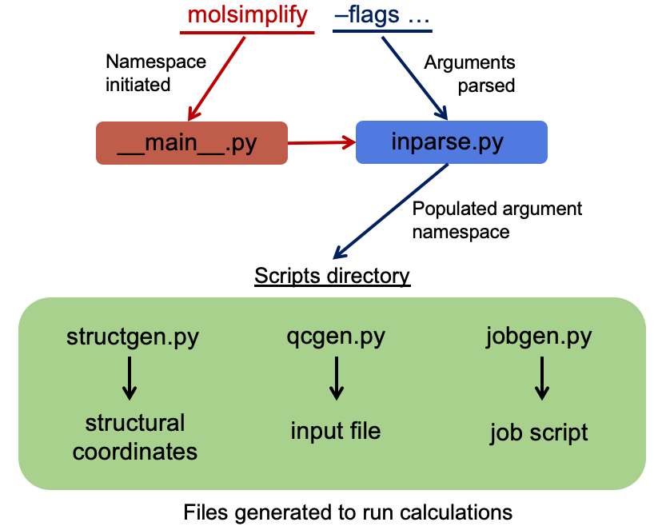

.. image:: logo.png
  :width: 600

Welcome to molSimplify's documentation!
=======================================

.. toctree::
   :maxdepth: 2 
   :caption: General Information

   Installation
   Citation

.. toctree::
   :maxdepth: 2
   :caption: Code Structure

| Descriptions of important folders and file organization:
| ``Classes:`` generic tools used to manipulate non-periodic molecular structures
| - ``mol3D.py``: object used to manipulate non-periodic molecular structure (not just transition metal complexes), composed of atom3D objects
| - ``atom3D.py``: object representing a single atom defined by position, identify, etc
| - ``globarvars.py``: contains all information about elements in the periodic table
| ``Cores``: templates for building transition metal complex
| ``Data``: template for coordination for not just octahedral coordination
| ``Informatics``: scripts and codes for featurization, revised autocorrelations, transformations of molecular information into numerical vectors, and other ML tools
| ``Ligands``: database of ligands which are used in molSimplify (if your ligand is not found here, there is a tutorial for adding to the ligand database)
| - ``ligands.dict``: contains mappings between ligand name and corresponding structure
| ``Scripts``: codes to write and measure geometries, and write input files
| ``job_manager``: automated large-scale job management scripts
| ``molscontrol``: dynamic classifier files
| ``python_nn``: bond length information for the very first bond length NN (2017 Chemical Science)
| ``sklearn_models``: models for static classification of whether a geometry is good or bad
| ``tf_nn``: published models from the group

.. toctree::
   :maxdepth: 2
   :caption: API

   Classes
   Scripts
   Informatics

.. toctree::
   :caption: Useful Links

   View Source Code (GitHub) <https://github.com/hjkgrp/molSimplify>
   Report an Issue <https://github.com/hjkgrp/molSimplify/issues>
   Visit Our Research Group Website <https://hjkgrp.mit.edu>
   Visit Our Interactive Site <https://molsimplify.mit.edu>

